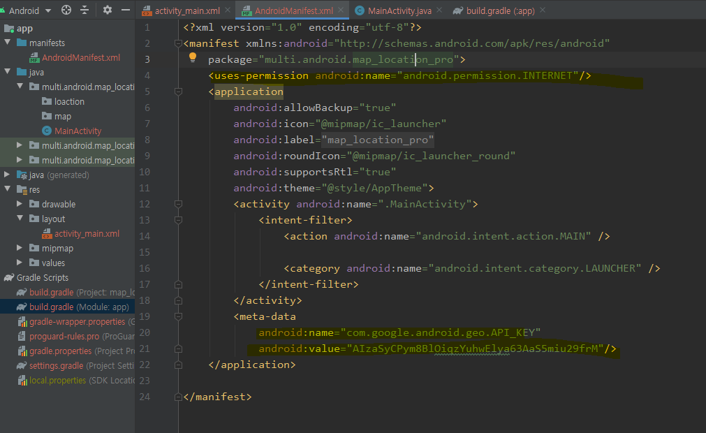

## Android

### 설치

1. developer.android.com
2. navigationbar -> android 스튜디오 선택 (android스튜디오는 최신 버전을 받아주는것이 좋다)

### 특징

- 컴포넌트 기반
  Activity -> 화면단 하나
  Service
  ContentProvider -> 메시지 앱에서 전화 앱 서로 정보 공유 해주는것
  BroadCasetReceiver
- 리소스의 외부화 (안드로이드는 리소스를 전부 외부화 시키는데 성공)
  문자열 이미지
  화면
  외부파일

### 200325

LinearLayout 으로 변환

버튼이 생성되는 

- layout_width = view의 너비
- layout_height = view의 높이
- orientation = 배치방향
- id = 각 위젯을 식별할 수 있는 이름
  		btn
          txt
- margin : 주위 여백
- padding : 내부 컨텐츠와 border사이의 간격
- layout_weight : 여백을 해당 view의 사이즈로 포함
- layout_gravity : parent내부에서 view의 정렬     
- gravity : view내부에서의 정렬                    

match_parent하면 다 겹쳐짐 -> 부모 사이즈로 맞취때문에

wrap_content로 모두 바꿔주면 다시 돌아오는 것을 볼 수 있다.

### 200407

- 선택 위젯
- 인텐트

#### 사용자 정의 Adapter만들기

- 안드로이드에서 앱을 구성할때 목록형식을 가장 많이 사용

- 사용자정의로 디자인한 뷰를 목록으로 사용하고 싶은 경우

- 안드로이드 내부에서 제공하는 Adapter로 표현하고 싶은 내용을 모두 표현할 수 없다.(이벤트연결, 각 목록의 구성을 다르게 생성)

  [구성요소]

  - Adapter를 이용해서 출력할 데이터를 저장하는 객체(DTO)

  - 사용자정의 Adapter

    1. 안드로이드에서 제공하는 Adapter클래스를 상속

       - 리스트뷰를 만들때 필요한 정보를 저장할 수 있도록 멤버변수 정의(Context, row디자인 리소스, 데이터)

    2. 생성자 정의

       - 상속받고 있는 ArrayAdapter의 생성자 호출

    3. ArrayAdapter에 정의되어 있는 메소드를 오버라이딩

       - getView : 리스트뷰의 한 항목이 만들어질때마다 호출

         ​			=> 전달된 리소스를 이용해서 뷰를 생성(LayoutInflater)

         ​			=> 한 row를 구성하는 뷰를 찾아서 데이터와 연결

    4. getView메소드에서 성능개선을 위한 코드를 작성

       - 한 번 생성한 view를 재사용
       - findViewById는 한 번만 찾아오기

    5. ViewHolder객체를 생성

       - row를 구성하는 뷰를 한번 findViewById하기
       - row에 대한 구성 View를 멤버변수로 선언
       - 생성자에서 findViewById처리를 구현
       - 최초로 뷰를 만들때(row에 대한 뷰) 이 객체를 생성해서 활용

    6. row를 구성하는 뷰에 상태값을 저장하기

       - 각 뷰의 이벤트를 통해 저장

       - 각 뷰의 상태값을 저장할 수 있도록 객체

         : 상태값을 저장한 객체를 자료 구조에 저장 

           focus를 잃어버릴때 상태를 저장

  - Adapter를 통해 만들어진 리스트뷰를 보여줄 액티비티
    
    - main layout 필요

### 200408

#### Intent

[기본실행]

1. 인텐트 객체를 생성하고 실행할 액티비티의 정보와 데이터를 셋팅

   - 값 : putExtra 메소드를 이용
   - 객체

2. 안드로이드OS에 인텐트 객체 넘기며 의뢰 

   액티비티 실행 startActivity

3. 인텐트에 설정되어 있는 액티비티 호출

4. 호출된 액티비티에서는 안드로이드OS가 넘겨준 인텐트를 가져오기

5. 인텐트에 셋팅된 데이터를 꺼내서 활용

### 200410

[[Permission종류]]

- 일반권한
- 위험권한

[[위험권한]]

액티비티를 실행하거나 버튼을 누르거나 어떤 기능을 사용할때 권한에 대한 처리를 할 수 있도록 구현

1. 사용 메소드

   - checkSelfPermission : 퍼미션의 현재 상태를 확인하는 메소드

     ​	             PERMISSION_GRANTED: 퍼미션이 부여되어 있는 상태

     ​                 PERMISSION_DENIED : 퍼미션이 부여되지 않은 상태

   - requestPermission : checkSelfPermission메소드의 리턴값이  PERMISSION_DENIED인 경우 권한이 체크되어 있지 않은 경우에 권한을 요청하는 메시지를 표시 (이 메소드 이외에도 제공되는 메소드는 여러개)

   - onRequestPermissionResult :  requestPermission의 결과로 호출되는 메소드 퍼미션 설정 정보를 매개변수로 넘긴다.

     ​                                           requestCode : 퍼미션 요청할 때 넘긴 요청코드

     ​                                           permission : 요청 퍼미션 목록

     ​                                          grantResults : 퍼미션 설정 성공 결과 

2. 처리순서

   1) 현재 사용하려고 하는 권한이 설정되어 있는지 체크

           - checkSelfPermission 이용

   2) 1번에서 리턴값이  PERMISSION_DENIED 인 경우 사용자가 권한을 설정할 수 있도록 메시지를 표시

   - requestPermission

   3) 요청 처리 후 자동으로 호출되는 메소드를 통해 다음에 어떤 처리를 할 것인지 정의

   ​	=> 권한 성공 -> 기능이 실행되도록 

    		권한 실패 -> Preference를 통해 설정할 수 있도록 액티비티를 이동하거나 안내 메시지 출력

### 200413

#### MAP

### 20200421

#### 안드로이드에서 쓰레드 처리하기

1. Handler를 이용

   오랜시간 처리해야하는 작업을 할 수 없다.

   1) 동시 실행흐름을 처리할 내용을 쓰레드 객체로 구현

   2) UI쓰레드에서 Handler 객체를 생성(구현 - 하위 객체)

   ​    onCreate메소드 내부에서 처리

   3) worker thread에서 Handler객체에게 작업을 의뢰

   4) Handler 객체에서 worker thread로 부터 의뢰받은 내용을 처리

   - handleMessage메소드를 이용해서 처리(오버라이딩해서 구현)
   - work thread한테 전달받은 값으로 view를 변경
   - 쓰레드로 부터 요청이 올때마다 handleMessage메소드가 호출된다.
   
2.  AsyncTest를 이용

    시간이 오래 걸리는 작업도 가능, UI를 변경하는 작업도 가능

   1) AsyncTask를 상속받는 클래스를 정의

   ​	=> AsyncTask에 제네릭을 적용해서 매개변수 세 개의 타입(사용자가 임의로)

      - 첫번째 제네릭 : execute를 호출해서 AsyncTask를 실행할때 필요한 매개변수의 타입

        ​                         이 매개변수가 doInBackground를 호출할때 전달

        ​                         

   - 두번째 제네릭 : publishProgress의 매개변수 타입

   ​                                 publishProgress가 호출할 onProgressUpdate의 매개변수

   ​								 즉, doInBackground메소드 내부에서 발생되는 값들로 화면에 출력되기 위해 필요한 값.

   - 세번째 제네릭 : doInBackground가 종료되고 리턴되는 값의 타입

     ​                         doInBackground가 종료되면 자동으로 onPostExecute가 호출되며 매개변수로 전달된다.

   2) 메소드를 오버라이딩

   - onPreExecute : doInBackground메소드가 호출되기 전에 실행되는 메소드

   ​                                 일반쓰레드로 처리할 일들(doInBackground에서 처리되는 작업)

   ​								 이 실행되기 전에 사전작업을 해야 하는 경우 구현

   ​							     메인쓰레드(UI쓰레드)에서 호출되는 메소드이므로 화면처리 가능

   ​								 UI쓰레드에서 호출하기 때문에 시간이 오래 걸리는 작업을 하면 안된다.

    - doInBackground : Background에서 실행될 작업을 정의

      ​                             일반 쓰레드에서 run메소드에 정의했던 코드를 구현

      ​                             네트워크 처리, 시간이 오래 걸리는 작업을 여기서 처리

      ​                             화면관련 처리는 할 수 없다.

      => 매개변수가 가변형이고 배열로 처리

   - onProgressUpdate : doInBackground 가 실행되는 중에 UI를 변경해야 할 일이 있는 경우에 호출되는 메소드

     ​                                 doInBackground 내부에서 화면을 변경해야 할 일이 생기면

      								publishProgress메소드를 호출하면 자동으로 onProgressUpdate가 호출된다.

     

   - onCanclled : 작업이 취소되는 경우 호출되는 메소드

   - onPostExecute : doInBackground메소드의 처리가 끝나면 호출되는 메소드

     ​                          UI쓰레드에서 호출하기 때문에 시간이 오래 걸리는 작업을 하면 안된다.(뷰를 변경할 수 있다.)

   3) AsyncTask의 하위객체를 생성

   4) 생성된 AsyncTask를 실행

   - AsyncTask의 execute메소드를 호출

   

   

   

   

   