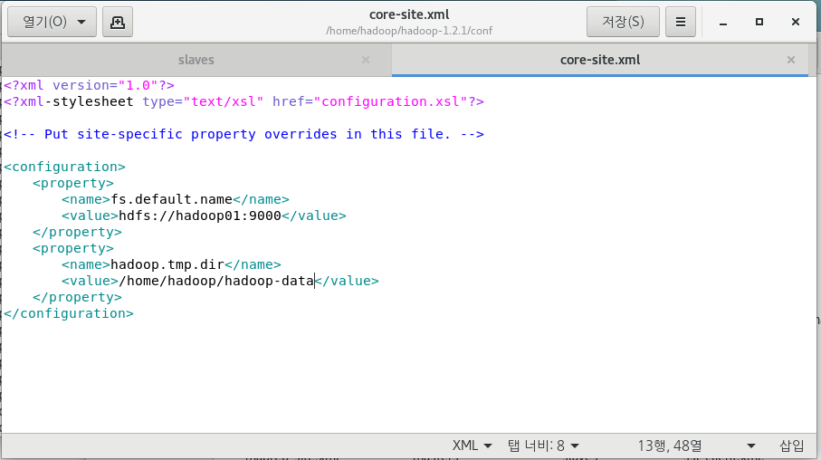
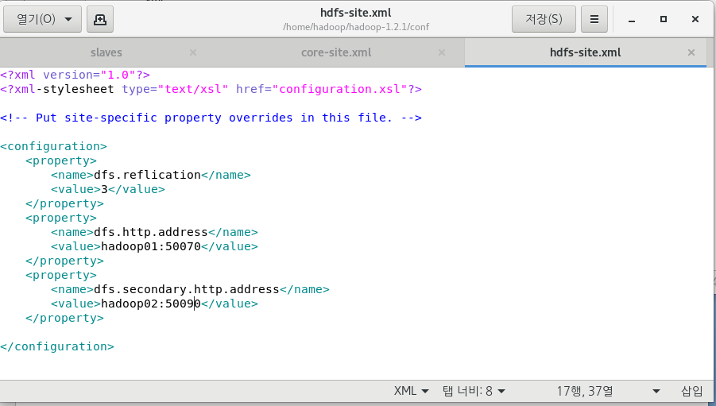
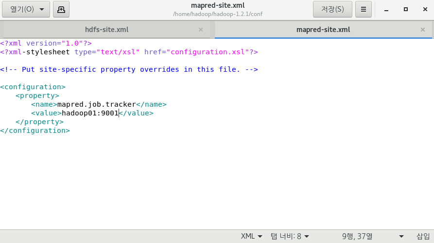
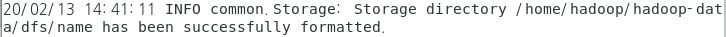
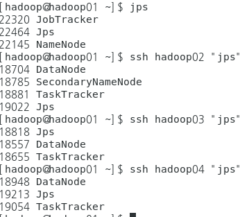
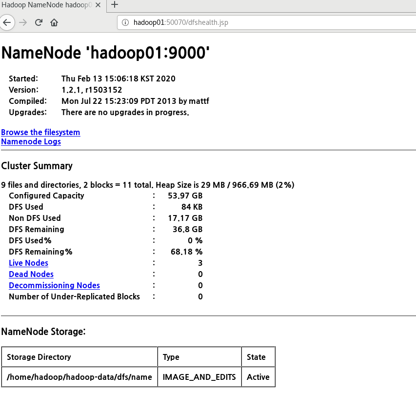

# Bigdata

# Hadoop

## CentOS 환경설정

www.oracle.com/j2se

java.sun.com/j2se

### 200213

rpm  -Uvh jdk-8u231-linux-x64.pm

scp /root/jdk-8u231-linux-x64.rpm root@hadoop02:/root/

ssh hadoop02 "rpm -Uvh jdk-8u231-linux-x64.rpm"

apache org  hadoop 1.2.1 tar gz 64 

hadoop은 hadoop 계정에서 쓸건데  그대로 위치에서 하면 root 권한이 남아있어서 설정 해주어야 함

scp hadoop-1.2.1.tar.gz hadoop@hadoop01:/home/hadoop

su hadoop

cd ~

ls  -> hadoop home 안에 hadoop tar.gz 파일 확인

-> 권한이 hadoop 으로 바뀐거 확인 가능	

tar -zxvf hadoop-1.2.1.tar.gz   -> 압축풀기

scp /home/hadoop/hadoop-1.2.1.tar.gz hadoop@hadoop02:/home/hadoop/

ssh hadoop02 "tar -zxvf hadoop-1.2.1.tar.gz"

conf folder에서

hadoop-env.sh 파일 에디터로 열고 

export JAVA_HOME=/usr/java/jdk1.8.0_231-amd64 설정 변경

자바 설치해놓은 디렉토리로 변경 해준다는 뜻

masters 파일 에디터로 열고 (secondery네임 노드 설정하는것)

hadoop02 로 내용 변경 후 저장

slaves 파일 에디터로 열고 (데이터 노드를 실행할 서버를 설정 하는것)

hadoop02
hadoop03
hadoop04

우리가 이름을 설정해주어서 이렇게 넣을수 있는 것이고 원래는 ip주소 넣어줘도 됨

mkdir hadoop-data  임시 디렉토리 생성

corefile 다른 프로그램으로 열기 g editer

hdfs gediter로 열고 설정파일 설정해주기

replication

mapred gediter로 열고 설정파일 설정해주기

이렇게 환경설정한 파일들을 나머지 노드에 붙여넣기 하기

->

scp /home/hadoop/hadoop-1.2.1/conf/* hadoop@hadoop02:/home/hadoop/hadoop-1.2.1/conf

/home/hadoop/hadoop-1.2.1/bin/hadoop namenode -format

successfully formatted. 만 확인

스타트해주기
/home/hadoop/hadoop-1.2.1/bin/start-all.sh 

확인해주기

/home/hadoop/hadoop-1.2.1/bin/stop-all.sh 

./bin/hadoop fs -mkdir /input   파일 생성

(만약 ip바뀌었을때)

- /etc/hosts

- scp모든 copy

- 네트워크프로세스 restart 

  (모든머신에)

Hadoop 계정에서 글자수 읽기 실행하기

[hadoop@hadoop01 root]$ cd ..
[hadoop@hadoop01 /]$ cd ~
[hadoop@hadoop01 ~]$ cd hadoop-1.2.1/
[hadoop@hadoop01 hadoop-1.2.1]$ /home/hadoop/hadoop-1.2.1/bin/start-all.sh

[hadoop@hadoop01 hadoop-1.2.1]$ /home/hadoop/hadoop-1.2.1/bin/hadoop fs -mkdir /myinput
mkdir: cannot create directory /myinput: File exists
[hadoop@hadoop01 hadoop-1.2.1]$ /home/hadoop/hadoop-1.2.1/bin/hadoop fs -copyFromLocal LICENSE.txt /myinput
[hadoop@hadoop01 hadoop-1.2.1]$ ./bin/hadoop jar hadoop-examples-1.2.1.jar  wordcount /myinput/LICENSE.txt /myoutput 

[root@hadoop01 ~]# echo $LANG
ko_KR.UTF-8

48page에 언어 설정 바꾸는거 있음

새로 sts bigdatawork 만들고

- utf-8로 변경
- tern 설치
- data tool 설치

build.xml -> 명령어를 만들어 놓은 파일 (ant 파일)

[hadoop@hadoop01 ~]$ ./hadoop-1.2.1/bin/hadoop jar multi-hadoop-examples.jar hdfs.exam.HDFSExam01 output.txt hellohadoop

=> jar파일을 실행하는 명령어 (경로를 안줘서 user 폴더가 생김)