# Bigdata

# Hadoop

## CentOS 환경설정

www.oracle.com/j2se

java.sun.com/j2se

### 200213

hostnamectl

rpm  -Uvh jdk-8u231-linux-x64.pm

scp /root/jdk-8u231-linux-x64.rpm root@hadoop02:/root/

ssh hadoop02 "rpm -Uvh jdk-8u231-linux-x64.rpm"

apache org  hadoop 1.2.1 tar gz 64 

hadoop은 hadoop 계정에서 쓸건데  그대로 위치에서 하면 root 권한이 남아있어서 설정 해주어야 함

scp hadoop-1.2.1.tar.gz hadoop@hadoop01:/home/hadoop

su hadoop

cd ~

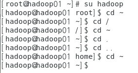

#은 home directory
$는 root directory

pwd 는 present working direcrtory checking 

ls  -> hadoop home 안에 hadoop tar.gz 파일 확인

-> 권한이 hadoop 으로 바뀐거 확인 가능	

tar -zxvf hadoop-1.2.1.tar.gz   -> 압축풀기

scp /home/hadoop/hadoop-1.2.1.tar.gz hadoop@hadoop02:/home/hadoop/

ssh hadoop02 "tar -zxvf hadoop-1.2.1.tar.gz"

conf folder에서

hadoop-env.sh 파일 에디터로 열고 

export JAVA_HOME=/usr/java/jdk1.8.0_231-amd64 설정 변경

자바 설치해놓은 디렉토리로 변경 해준다는 뜻

masters 파일 에디터로 열고 (secondery네임 노드 설정하는것)

hadoop02 로 내용 변경 후 저장

slaves 파일 에디터로 열고 (데이터 노드를 실행할 서버를 설정 하는것)

hadoop02
hadoop03
hadoop04

우리가 이름을 설정해주어서 이렇게 넣을수 있는 것이고 원래는 ip주소 넣어줘도 됨

mkdir hadoop-data  임시 디렉토리 생성

corefile 다른 프로그램으로 열기 g editer

hdfs gediter로 열고 설정파일 설정해주기

replication

mapred gediter로 열고 설정파일 설정해주기

이렇게 환경설정한 파일들을 나머지 노드에 붙여넣기 하기

->

scp /home/hadoop/hadoop-1.2.1/conf/* hadoop@hadoop02:/home/hadoop/hadoop-1.2.1/conf

/home/hadoop/hadoop-1.2.1/bin/hadoop namenode -format

successfully formatted. 만 확인

스타트해주기
/home/hadoop/hadoop-1.2.1/bin/start-all.sh 

확인해주기

/home/hadoop/hadoop-1.2.1/bin/stop-all.sh 

./bin/hadoop fs -mkdir /input   파일 생성

(만약 ip바뀌었을때)

- /etc/hosts

- scp모든 copy

- 네트워크프로세스 restart 

  (모든머신에)

Hadoop 계정에서 글자수 읽기 실행하기

[hadoop@hadoop01 root]$ cd ..
[hadoop@hadoop01 /]$ cd ~
[hadoop@hadoop01 ~]$ cd hadoop-1.2.1/
[hadoop@hadoop01 hadoop-1.2.1]$ /home/hadoop/hadoop-1.2.1/bin/start-all.sh

[hadoop@hadoop01 hadoop-1.2.1]$ /home/hadoop/hadoop-1.2.1/bin/hadoop fs -mkdir /myinput
mkdir: cannot create directory /myinput: File exists
[hadoop@hadoop01 hadoop-1.2.1]$ /home/hadoop/hadoop-1.2.1/bin/hadoop fs -copyFromLocal LICENSE.txt /myinput
[hadoop@hadoop01 hadoop-1.2.1]$ ./bin/hadoop jar hadoop-examples-1.2.1.jar  wordcount /myinput/LICENSE.txt /myoutput 

[root@hadoop01 ~]# echo $LANG
ko_KR.UTF-8

48page에 언어 설정 바꾸는거 있음

새로 sts bigdatawork 만들고

- utf-8로 변경
- tern 설치
- data tool 설치

build.xml -> 명령어를 만들어 놓은 파일 (ant 파일)

[hadoop@hadoop01 ~]$ ./hadoop-1.2.1/bin/hadoop jar multi-hadoop-examples.jar hdfs.exam.HDFSExam01 output.txt hellohadoop

=> jar파일을 실행하는 명령어 (경로를 안줘서 user 폴더가 생김)

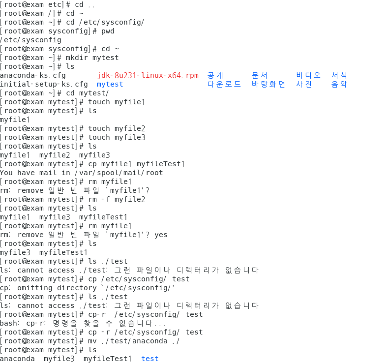

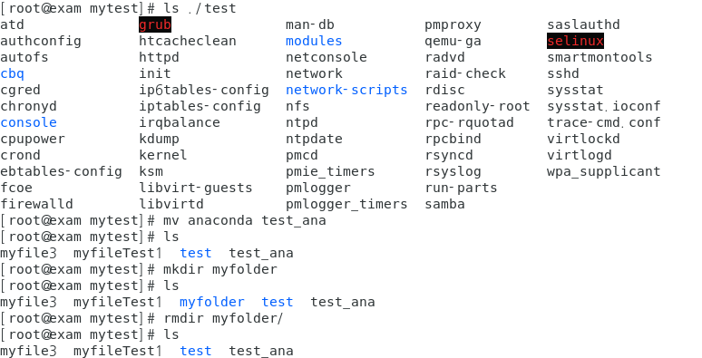

### mapper

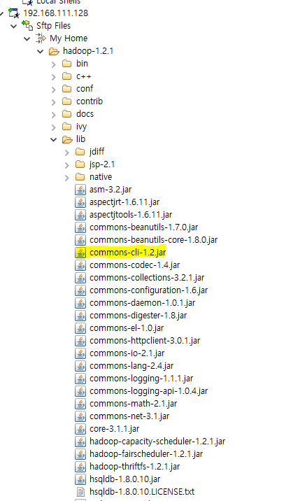

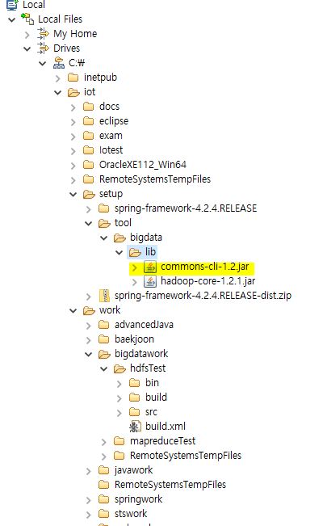

이렇게 추가

### 200220

README.txt 파일 복사 생성

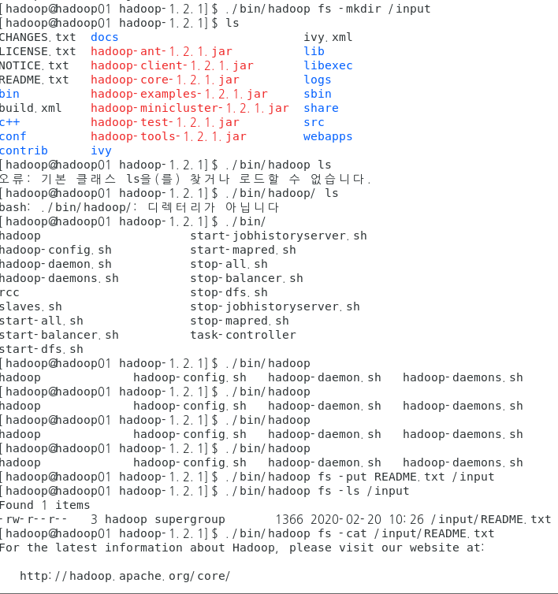

### 200221

- MultiplOutputs

  => 한 개의 입력 데이터를 이용해서 여러 개의 output을 만들고 싶은 경우 사용
  Mapper : GenericOptionParser작업할 때와 동일하게 map메소드를 구성하며 보통 구분할 수 있도록 key에 각 상황별로 문자열만 추가해 준다.

  Reducer : Mapper에서 넘겨준 데이터에서 구분자를 기준으로 분리해서 합산 - 개별 output이 생성될 수 있도록 처리

   - setup : Reducer 객체가 처음 실행될때 한 번 호출되는 메소드
     			MultipleOutputs객체를 생성
   - reduce : 각각의 상황별로 write가 호출될 수 있도록 처리
                   (up, equal, down)
   - cleanup : Reducer의 작업이 종료될때 한 번 호출되는 메소드
                     MultipleOutputs객체를 해제(반드시처리)

  Driver : MultipleOutputs로 출력될 경로를 Path에 설정 prefix로 구분문자열을 정의

### 200224

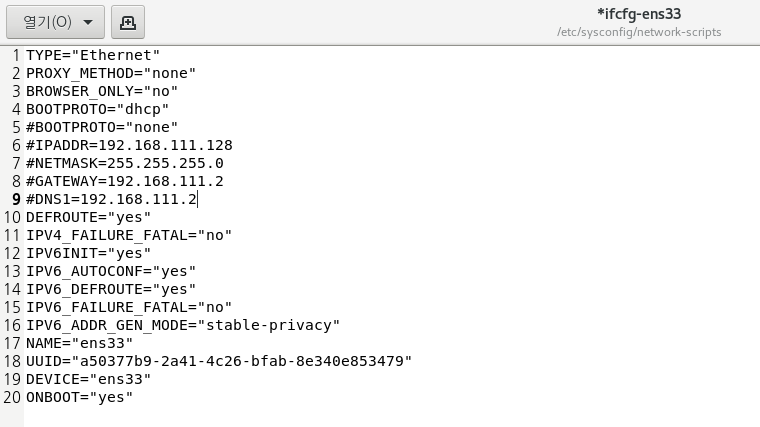

다 변경 해주기

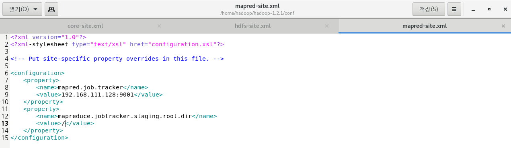

[hadoop@hadoop01 hadoop-1.2.1]$ scp /home/hadoop/hadoop-1.2.1/conf/* hadoop@hadoop04:/home/hadoop/hadoop-1.2.1/conf/

copy 해주기

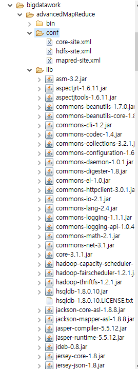

sts 로 옮겨주기

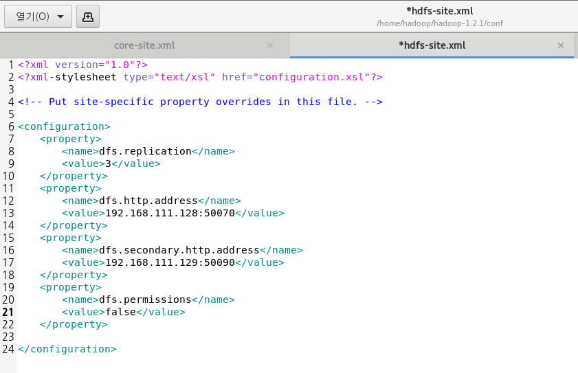

sts로 옮겨서 run configuration 등 실행 후 오류 고치기 위한 수정 후 모든 머신에 복사 후 실행

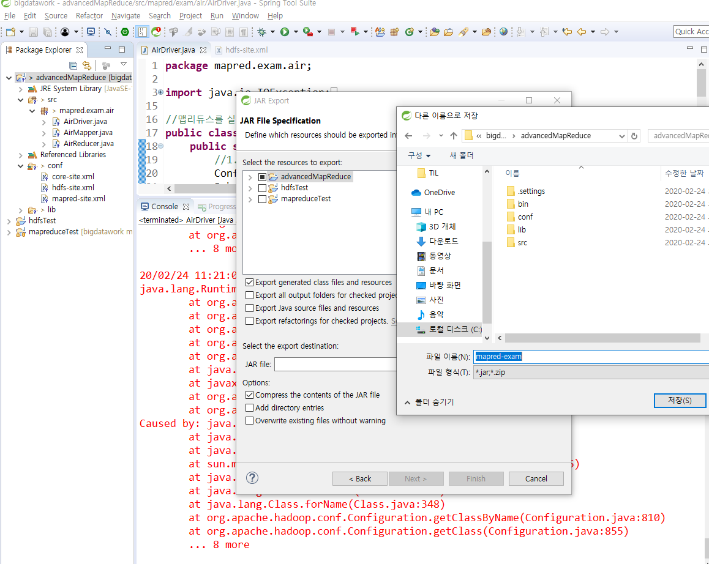

오류 뜨기 때문에 jar로 export

#### <정규표현식>

다른 프로그램에서도 똑같이 적용되는 규칙

텍스트 안에서 특정 형식의 문자열을 추출하거나 검색할때 사용하는 특수문자로 만들어진 패턴

1. 자바 API

   1.  String 클래스의 matches메소드 : 매개변수로 전달한 정규 표현식에 일치하는 문자열이 있는지를 boolean으로 리턴

   2.  java.util.regex 패키지의 클래스들을 활용

      - Pattern 클래스 : 패턴을 정의할때 사용

        ​			CASE_INTENSITIVE : 대소문자 적용하지 않는다는 의미

      - Matcher 클래스 : 패턴과 일치하는 문자열을 관리하는 클래스

        ​	find() : 패턴에 만족하는 문자열이 있는지 찾기 (true | false 리턴)

        ​	start() : 매칭되는 패턴과 일치하는 문자열의 start index	

        ​	end() : 패턴과 일치하는 문자열의 end index +1

        ​	group() : 패턴과 일치하는 문자열을 리턴 (일치하는 문자 추출)

2. Pattern기호

   1.  기본기호

      ^

      $

      .

      |

      []

      ()  : 그룹으로 묶을 경우 사용

   2.  수량관련기호

      *:  *앞의 패턴문자가 0이거나 1이거나 여러 개 잇거나

      +: +앞의 패턴문자가 1이거나 여러 개 있거나

      ?: ?앞의 패턴문자가 없거나 1이거나

      .{n}  : .은 임의의 한 문자를 의미 n은 글자수를 의미
      		 어떤 문자이거나 n개의 문자

      xxxx{1,3} : 1이상 3이하 (x는 패턴을 의미)

      xxxx{3, }  : 3이상 