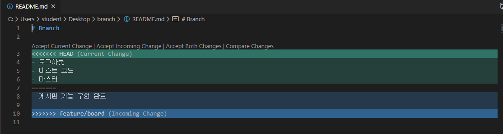

# Git branch

## 1. branch 관련 명령어

> Git 브랜치를 위해 root-commit을 발생시키고 진행하세요.

1. 브랜치 생성

   ```bash
   (master) $ git branch {브랜치명}
   ```

2. 브랜치 이동

   ```bash
   (master) $ git checkout {브랜치명}
   ```

3. 브랜치 생성 및 이동

   ```bash
   (master) $ git checkout -b {브랜치명}
   ```

4. 브랜치 삭제

   ```bash
   (master) $ git branch -d {브랜치명}
   ```

5. 브랜치 목록

   ```bash
   (master) $ git branch
   ```

6. 브랜치 병합

   ```
   (master) $ git merge {브랜치명}
   ```

   - master 브랜치에서 {브랜치명}을 병합

## 2. branch 병합 시나리오

> branch 관련된 명령어는 간단하다.
>
> 다양한 시나리오 속에서 어떤 상황인지 파악하고 자유롭게 활용할 수 있어야 한다.

### 상황 1. fast-foward

> fast-foward는 feature 브랜치 생성된 이후 master 브랜치에 변경 사항이 없는 상황

1. feature/test branch 생성 및 이동

   ```bash
   # 엔터 탭 backspace
    (master)$ git checkout -b feature/test
   Switched to a new branch 'feature/test'
   (feature/test) $git
   
   ```

   

2. 작업 완료 후 commit

   ```bash
   $ touch test.txt
   $ git add .
   $ git commit -m 'Complete test'
   ```

   

3. master 이동

   ```bash
    (feature/test)$ git checkout master
   Switched to branch 'master'
   (master) $
   ```

   

4. master에 병합

   ```bash
   $ git merge feature/test
   Updating 993ca24..5e2da8f
   Fast-forward
    test.txt | 0
    1 file changed, 0 insertions(+), 0 deletions(-)
    create mode 100644 test.txt
   ```

   

5. 결과 -> fast-foward (단순히 HEAD를 이동)

   ```bash
   $ git log --oneline
   5e2da8f (HEAD -> master, feature/test) Complete test;
   993ca24 Complete menu
   fc557fe Init
   ```

   

6. branch 삭제

   ```bash
   $ git branch -d feature/test
   Deleted branch feature/test (was 5e2da8f).
   ```

   

------

### 상황 2. merge commit

> 서로 다른 이력(commit)을 병합(merge)하는 과정에서 **다른 파일이 수정**되어 있는 상황
>
> git이 auto merging을 진행하고, **commit이 발생된다.**

1. feature/signout branch 생성 및 이동

   ```bash
   $git checkout -b feature/signout
   ```

2. 작업 완료 후 commit

   ```bash
   $ touch signout.txt
   $ git add .
   $ git commit -m 'Complete signout'
   ```

   

3. master 이동

   ```bash
   $git checkout master
   ```

   

4. *master에 추가 commit 이 발생시키기!!*

   ```bash
   
   $git checkout master
   $ git add .
   $ git commit -m 'Hotfix'
   ```

   

   - **다른 파일을 수정 혹은 생성하세요!**

5. master에 병합

   ```bash
   (master) $ git merge feature/signout
   ```

   

6. 결과 -> 자동으로 *merge commit 발생*

   - vim 편집기 화면이 나타납니다.

   - 자동으로 작성된 커밋 메시지를 확인하고, `esc`를 누른 후 `:wq`를 입력하여 저장 및 종료를 합니다.

     - `w` : write
     - `q` : quit

   - 커밋이 확인 해봅시다.

     ```bash
     $ git log --oneline
     7774ae0 (HEAD -> master) Merge branch 'feature/signout'
     4da2b05 Hotfix
     0b9aff1 (feature/signout) Complete signout
     5e2da8f Complete test;
     993ca24 Complete menu
     fc557fe Init
     ```

     

7. 그래프 확인하기

   ```bash
   $ git log --oneline --graph
   *   7774ae0 (HEAD -> master) Merge branch 'feature/signout'
   |\
   | * 0b9aff1 (feature/signout) Complete signout
   * | 4da2b05 Hotfix
   |/
   * 5e2da8f Complete test;
   * 993ca24 Complete menu
   * fc557fe Init
   ```

   

8. branch 삭제

   ```bash
   $git branch -d feature/signout
   Deleted branch feature/signout (was 0b9aff1).
   ```

   

------

### 상황 3. merge commit 충돌

> 서로 다른 이력(commit)을 병합(merge)하는 과정에서 **같은 파일의 동일한 부분이 수정**되어 있는 상황
>
> git이 auto merging을 하지 못하고, 충돌 메시지가 뜬다.
>
> 해당 파일의 위치에 표준형식에 따라 표시 해준다.
>
> 원하는 형태의 코드로 직접 수정을 하고 직접 commit을 발생 시켜야 한다.

1. feature/board branch 생성 및 이동

   ```bash
   $ git checkout -b feature/board
   Switched to a new branch 'feature/board'
   ```

2. 작업 완료 후 commit

   ```bash
   $ touch board.txt
   # README.md 파일 수정
   $ git add .
   $ git commit -m <>
   ```

3. master 이동

   ```bash
   $ git checkout master
   
   ```

   

4. *master에 추가 commit 이 발생시키기!!*

   - **동일 파일을 수정 혹은 생성하세요!**

     ```bash
     #README.md 파일 수정
     $ git add .
     $ git commit -m 'Update README'
     ```

     

5. master에 병합

   ```bash
   $ git merge feature/board
   Auto-merging README.md
   CONFLICT (content): Merge conflict in README.md
   Automatic merge failed; fix conflicts and then commit the result.
   ```

   

6. 결과 -> *merge conflict발생*

   > git status 명령어로 충돌 파일을 확인할 수 있음.

   ```bash
    (master|MERGING) $ git status
   On branch master
   You have unmerged paths.
     (fix conflicts and run "git commit")
     (use "git merge --abort" to abort the merge)
   
   Changes to be committed:
           new file:   board.txt
   
   Unmerged paths:
     (use "git add <file>..." to mark resolution)
           both modified:   README.md
   
   ```

   

7. 충돌 확인 및 해결

   

   VScode로 더 세부적으로 확인 가능

8. merge commit 진행

   ```bash
   $ git commit
   ```

   - vim 편집기 화면이 나타납니다.

   - 자동으로 작성된 커밋 메시지를 확인하고, `esc`를 누른 후 `:wq`를 입력하여 저장 및 종료를 합니다.

     - `w` : write
     - `q` : quit

   - 커밋이 확인 해봅시다.

     ```bash
     $ git log --oneline
     3e9e903 (HEAD -> master) Merge branch 'feature/board'
     38f0b91 Update README
     027454f (feature/board) Complete board & update README.md
     7774ae0 Merge branch 'feature/signout'
     4da2b05 Hotfix
     0b9aff1 Complete signout
     5e2da8f Complete test;
     993ca24 Complete menu
     fc557fe Init
     ```

     

9. 그래프 확인하기

   ```bash
   $ git log --oneline --graph
   *   3e9e903 (HEAD -> master) Merge branch 'feature/board'
   |\
   | * 027454f (feature/board) Complete board & update README.md
   * | 38f0b91 Update README
   |/
   *   7774ae0 Merge branch 'feature/signout'
   |\
   | * 0b9aff1 Complete signout
   * | 4da2b05 Hotfix
   |/
   * 5e2da8f Complete test;
   * 993ca24 Complete menu
   * fc557fe Init
   ```

   

10. branch 삭제


# Stash

> 작업 내역을 임시 저장 할 수 있음.

## 기본 명령어

```bash
# 1. stash 공간에 작업내역 저장
$ git stash
Saved working directory and index state WIP on master
```

```bash
# 2. stash list 보기
$ git stash list
stash@{0} : WIP on master : a8cd8e9 Init
```

```bash
# 3. 임시 공간 내용 가져오기
$ git stash pop
```

## 예시

- 로컬에서 작업하고 있던 중, pull을 받아서 원격 저장소에 새로운 내용을 반영 해야 하는 경우

```bash
$ git pull origin master
From https://github.com/edutak/big-iot-1001
* branch     master -> FETCH_HEAD
error : Your local changes to the following files woule:
		README.md
# 1. 커밋하거나 => 버전으로 
# 2. stash => 작업 중일 떄
Please commit your 
```

- 해결방법

```bash

```

# Rest vs Revert

## 1. reset

- 특정 버전으로 되돌아가는 작업

```bash
$ git reset {커밋 해시코드}
```

- reset 명령어의 결과는 다음과 같다

  ```bash
  $ git log --online
  
  ```

  - reset 옵션
    - 기본 : 이전 이력의 변경사항을 WD에 보관
    - --hard : 이전 이력의 변경 사항은 모두 삭제, **주의**

## 2. revert

- 특정 시점을 되돌렸다는 커밋을 발생 시킴.

```bash
$ git log --oneline
```


# Link

| https://github.com/JaeYeopHan/Interview_Question_for_Beginner | 개발자 기술 면접                                |
| ------------------------------------------------------------ | ----------------------------------------------- |
| https://github.com/jojoldu/junior-recruit-scheduler          | 주니어 개발자 채용 정보                         |
| https://github.com/milooy/remote-or-flexible-work-company-in-korea | 원격 근무 회사                                  |
| https://blog.ull.im/engineering/2019/03/10/logs-on-git.html  | 좋은 git commit 메시지를 위한 영어 사전         |
| https://d2.naver.com/news/3435170                            | 백엔드 개발자를 꿈꾸는 학생개발자에게           |
| https://meetup.toast.com/posts/106                           | 좋은 git 커밋 메시지를 작성하기 위한 7가지 약속 |
| https://startbootstrap.com/themes/resume/                    | 레쥬메                                          |
| https://gist.github.com/edutak/fed5745cc86e4d9d32cef833d1d280a2 | 브랜치 시나리오                                 |
| **https://git-scm.com/book/ko/v2**                           | **git 책**                                      |


https://backlog.com/git-tutorial/kr/stepup/stepup7_2.html