## MongoDB

- nosql
- 비정형 데이터(스키마가 없다)
- Json
- joinx

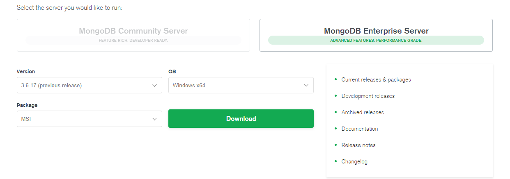

다운로드 

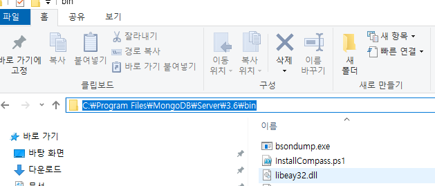

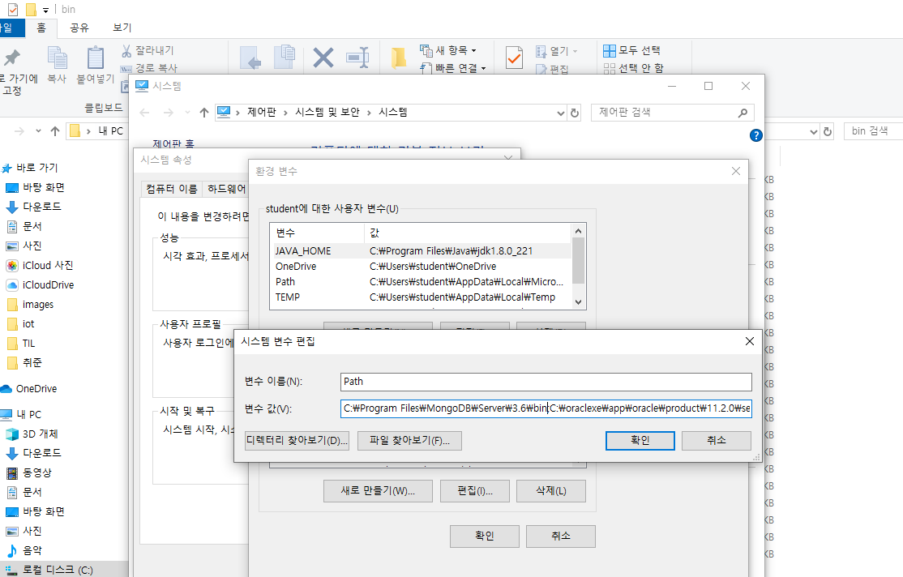

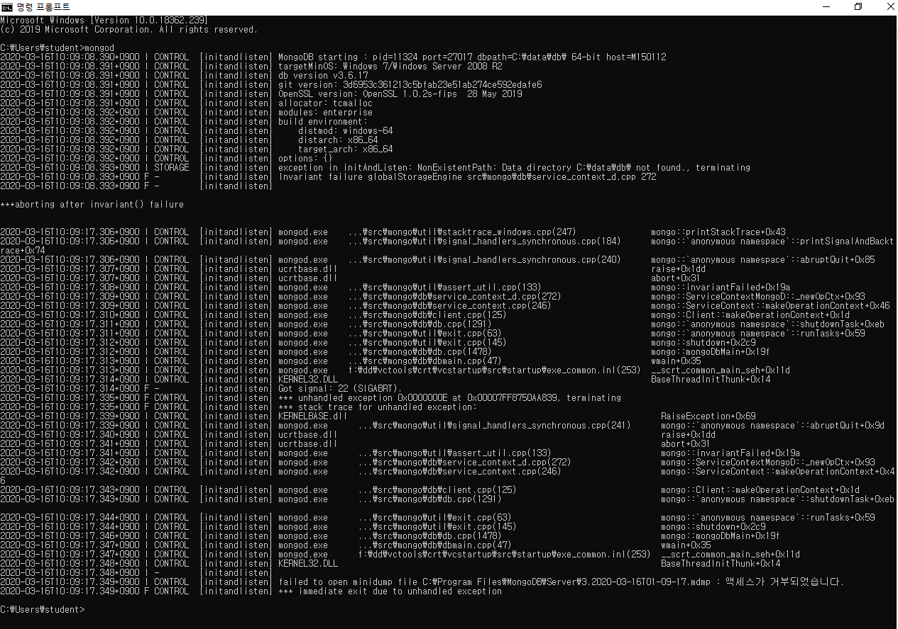

저장하는 폴더가 없어서 오류 뜸

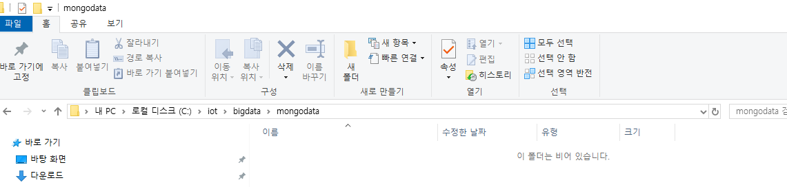

폴더를 만들어 줌

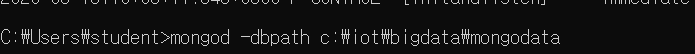

이렇게 생성 (당연히 할때마다 설정파일을 수정해서 폴더를 등록해줄수 있다)

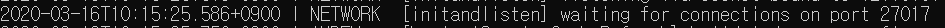

확인 가능

다른 cmd를 켜서 mongo를 실행

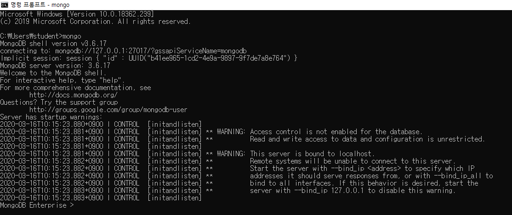

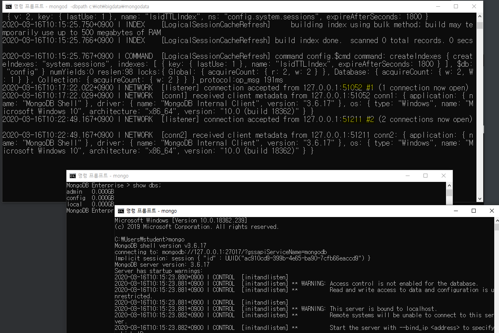

cmd 하나 더 켜서 로그인 하면 #2로 client가 두명이 로그인 한것을 보여 준다

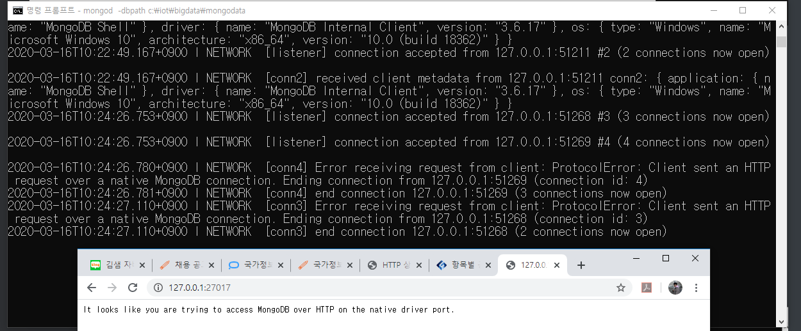

인터넷으로 접근한 것도 보여 준다

mongo db<용어>

- collection : 테이블
- document : 레코드
- field : 컬럼
- _id : 정렬키

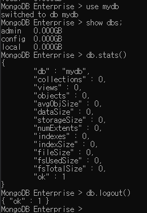

json 형태로 출력 됨 (기본 구문)

1. collection(rdbms에서 테이블과 동일한 개념)

   => 관계형 데이터베이스 처럼 스키마를 정의하지 않는다.

   1) 종류

    - capped collection

      : 고정 사이즈 주고 생성하는 컬렉션
        미리 지정한 저장 공간이 모두 사용이 되면 맨 처음에 저장된 데이터가 삭제되고 공간으로 활용

    - non capped collection

      : 일반적인 컬렉션

   2) Collection 관리

   ​	[생성]

   ​	db.createCollection("컬렉션명")-> 일반collection

   ​	db.createCollection("컬렉션명",{옵션list})

   ​			=> 각각의 옵션을 설정해서 작업(json)

   ​	[삭제]

   ​	db.collection명.drop()

   ​	[컬렉션명 변경]

   ​	db.컬렉션명.renameCollection("변경할컬렉션명");

   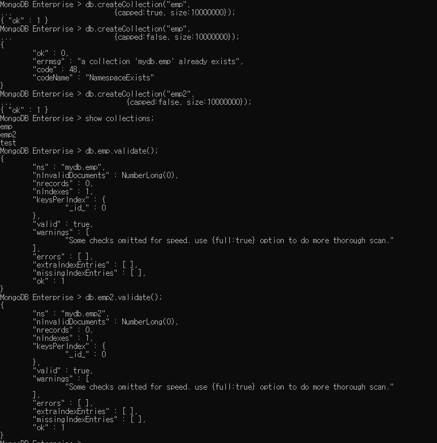

   

   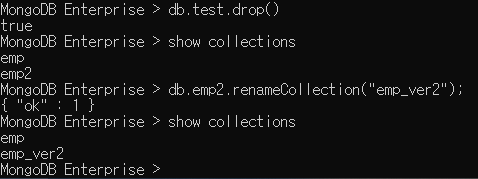

   

2. mongodb에 insert

   [구문]

   db.컬렉션명.insert({데이터...})

   db.컬렉션명.insertOne({데이터...})

   db.컬렉션명.insertMany({데이터...})

   - document(관계형db에서 레코드 개념)에 대한 정보는 json의 형식으로 자성

   - mongodb에서 document를 삽입하면 자동으로 _id가 생성 -기본키의 역할

      "_id" : ObjectId("5e6ee72b5064e52b819b01ad")

     ​							\-------------------------------------
     현재 timestamp+machine id+ mongodb프로세스id+ 순차번호 (추가될때마다 증가)

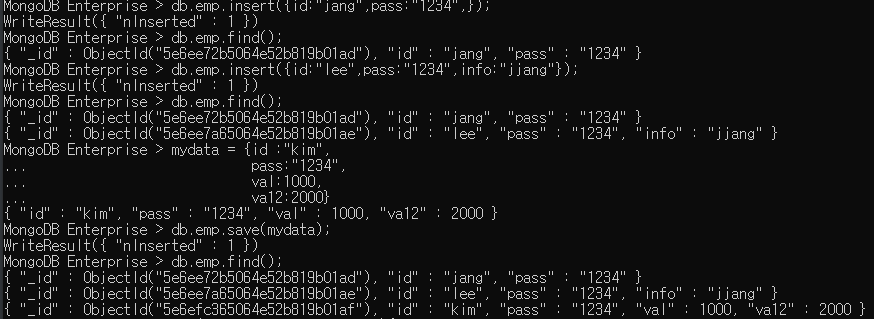

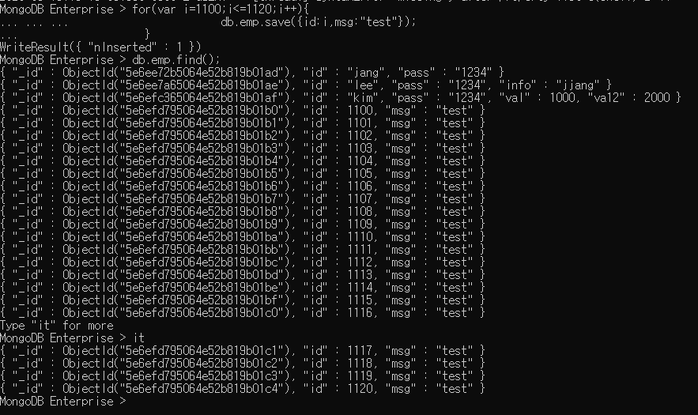

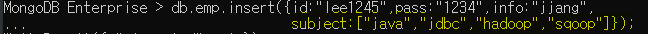

배열은 [] json의 형식을 따르기 때문에.

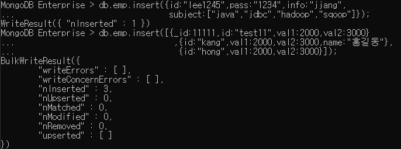

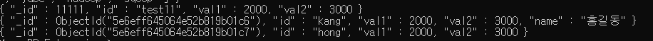

3. mongodb에 update

   - document  수정
   - 조건을 적용해서 수정하기 위한 코드도 json으로 구현

   [update를 위한 명령어]

   $set : 해당필드의 값을 변경(업데이트를 하기 위한 핵심 명령어)

   ​		  none capped collection인 경우 업데이트할 필드가 없는 경우 추가한다.

   업데이트 옵션 :

   ​			multi => true를 추가하지 않으면 조건에 만족하는 document 중 첫 번째 document만 update

   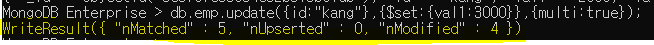

   $inc : 해당필드의 저장된 숫자의 값을 증가

   $unset : 원하는 필드를 삭제할 수 있다.

   [구문]

   db.컬렉션명.update({조건필드:값},//sql의 update문 where절)

     							   {$set:{수정할 필드: 수정값} }, //set절

   ​								{update와 관련된 옵션: 옵션값}) // 필요없으면 안줘도 됀다

   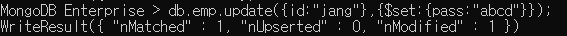

   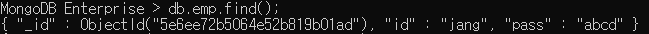

   

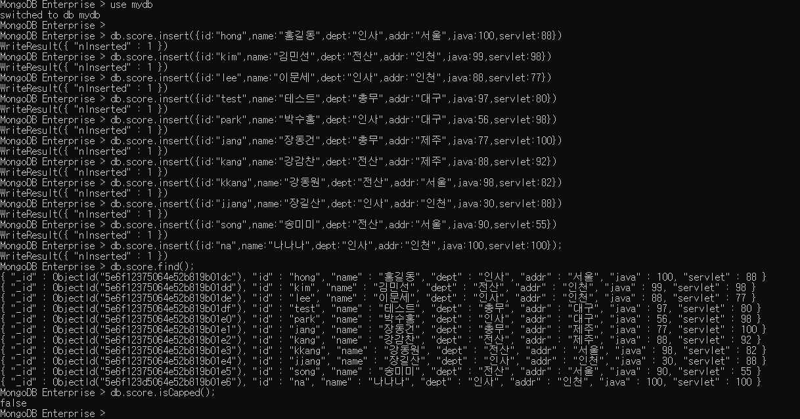

capped를 설정하지 않고 따로 collection을 만들지 않고 그냥 넣어주어도 알아서 collection을 생성하고 기본으로 capped를 false로 만들어 준다

[배열]

db.score.update({id:"jang"},
...                                       {$set:
...                                         {info:
...                                           {city:["서울","안양"],
...                                             movie:["겨울왕국2","극한직업","쉬리"]
...                                            }
...                                          }
...                                         }
...                                       );

[배열에서 사용할 수 있는 명령어]
$addToSet : 배열의 요소를 추가
					(없는 경우에만 값을 추가, 중복을 체크)
 db.score.update({id:"jang"},
							{$addToSet:{"info.city":"인천"}});

$push : 배열의 요소를 추가
 	       (중복을 허용)

db.score.update({id:"jang"},
							{$push:{"info.city":"천안"}});

$pop
배열에서 요소를 제거할 때 사용
1이면 마지막 요소를 제거, -1이면 첫 번째 요소를 제거

 db.score.update({id:"jang"},
							{$pop:{"info.city":1}});
db.score.update({id:"jang"},
							{$pop:{"info.city":-1}});

$each : addToSet이나 push에서 사용할 수 있다.
			여러 개를 배열에 추가할 때 사용
db.score.update({id:"jang"},
							{$push:
										{"info.city":
														{$each:["천안","가평","군산"] ,$sort:-1}
										}
								}
					);

$sort : 정렬(1:오름차순, -1: 내림차순)

$pull : 배열에서 조건에 만족하는 요소를 제거(조건 한 개)
db.score.update({id:"jang"},{$pull:{"info.city":"천안"}});

$pullAll : 배열에서 조건에 만족하는 요소를 제거(조건을 여러 개)
db.score.update({id:"jang"},{$pullAll:{"info.city":["가평","군산"]}});

과제

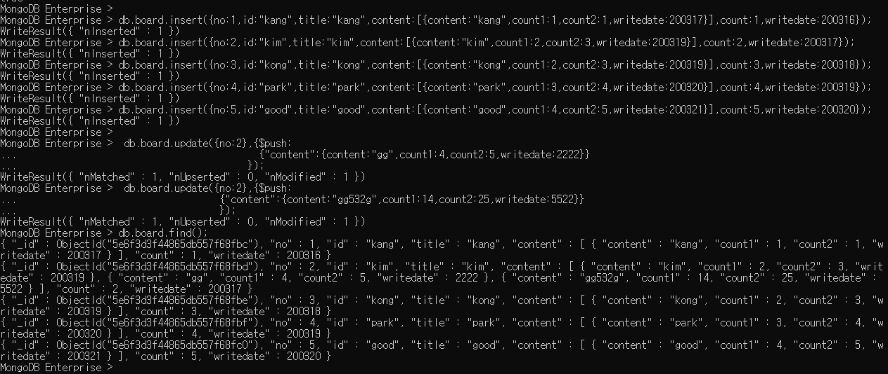

