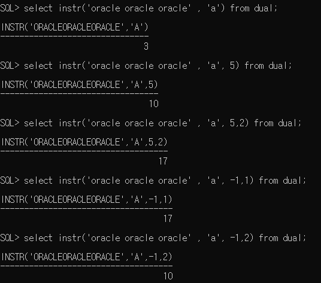

# 1.Oracle

## 1.함수

### 	1.단일행 함수

​		select, where, order by 절에 모두 사용할 수 있다.

   - 문자함수

     - lower(문자열 or 컬럼명): 값을 소문자로 변환

     - upper(문자열 or 컬럼명): 값을 대문자로 변환

     - initcap(문자열 or 컬럼명): 전달된 값의 첫 글자만 대문자로 변환

     - substr(문자열 or 컬럼명, 시작위치, 문자열의 갯수)

     - length(문자열 or 컬럼명) : 문자열의 길이를 반환

     - instr(문자열 or 컬럼명, 찾을 문자, 찾을 위치, n번째 문자) : 특정 컬럼이나 문자열에서 문자의 위치를 찾을때 사용하는 함수

       

       찾을 위치나 n번째 문자에 대한 매개변수는 생략이 가능

       찾을 위치를 -1로 정의하면 문자열의 오른쪽 긑에서 문자를 찾는다.

      - concat(문자열 or 컬럼명, 문자열 or 컬럼명) : ||(문자열 연결)연산자와 동일
     
      - lpad(문자열 or 컬러명, 출력할 문자열의 길이, 채워줄 문자): 전체 출력할 문자열의 길이에 문자열을 출력한 후 남는 공간에 정의한 문자를 채워 출력해주는 함수(왼쪽)
     
      - rpad(문자열 or 컬러명, 출력할 문자열의 길이, 채워줄 문자): 전체 출력할 문자열의 길이에 문자열을 출력한 후 남는 공간에 정의한 문자를 채워 출력해주는 함수(오른쪽)

     - ltrim(문자열 or 컬럼명, 제거할 문자): 컬럼에서 매개변수로 정의한 문자를 왼쪽에서 찾아 모두 제거(연속된 문자만 제거)

      - rtrim(문자열 or 컬럼명, 제거할 문자): 컬럼에서 매개변수로 정의한 문자를 오른쪽에서 찾아 모두 제거(연속된 문자만 제거)

   - 숫자함수

      - round(숫자, 반올림할 위치): 반올림

   - 변환함수

      - 데이터의 타입을 변환하기 위한 함수

      - 또 다른 함수의 매개변수로 사용하게 될 경우 타입이 컬럼의 타입과 일치해야 하므로

      - cast(값 or 컬럼명 as 타입)

            -날짜 : date
            
            -숫자 : integer

      - to _char(변환할 데이터, 표시할 format)

            -숫자를 문자열로 변환

         ​    숫자의 한 자리를 표시 => 9, 0

         ​    콤마 => ,

         ​	소수점 =>.

         ​	통화기호 => $,L(지역의 통화기호를 출력)

            -날짜를 문자열로 변환 : 년 월 일 각각의 데이터를 추출하고 싶은 경우
      
   - 날짜함수
     
        - sysdate -5, +5
     
   - null처리함수
     
        - nvl(컬럼, null인 경우 처리할 식이나 값) - null경우 대신할 식이나 값을 명시
       
         - nvl2(컬럼, 표현값1, 표현값2)
        
             ​				'------------   ------------'
          
             ​			null X  경우   null 인 경우

### 2. 그룹함수

- group by를 적용한 후에 사용할 함수
- sum ,avg, max, min, count 등

## 2. 그룹화

	> select 컬럼...
	>
	> from 테이블...
	>
	> where 조건
	>
	> group by 그룹화할 컬럼명(함수를 포함한 식도 가능)
	>
	> having group by한 결과에 적용할 조건
	>
	> order by 정렬할 컬럼명

 - 테이블에 저장된 레코드를 그룹화 하여 분류하고 싶은 경우 사용

 - select 절에는 group by 절에 명시한 컬럼명과 그룹함수만 사용할 수 있다.

 - 데이터가 복잡한 경우 group by절에 두 개 이상의 컬럼을 명시할 수 있다.

 - group by 하기 전에 적용해야 하는 조건은 where절에 정의

 - group by 한 결과에 조건을 적용해야 하는 경우 having 절을 이용

   ​																				'----------'

   ​																				조건에 그룹함수를 써야 하면 having을 추가 한다

- 