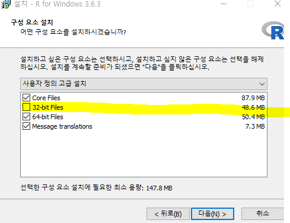
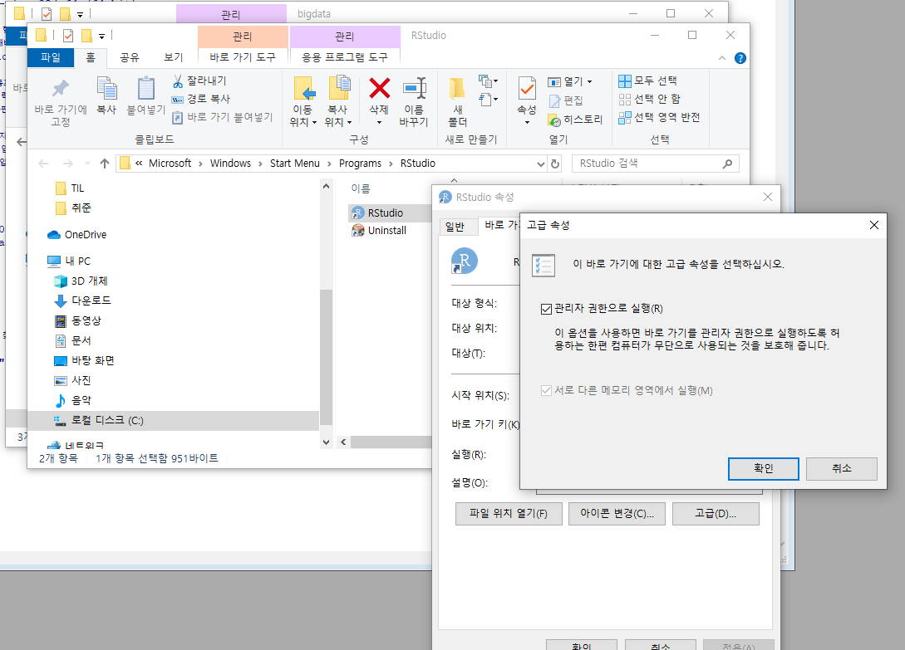
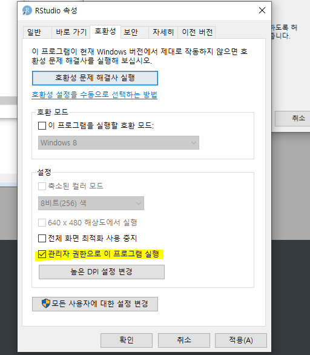
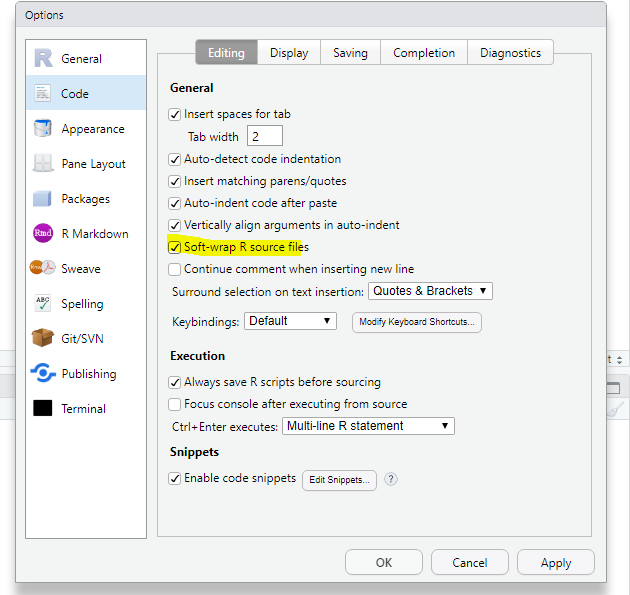
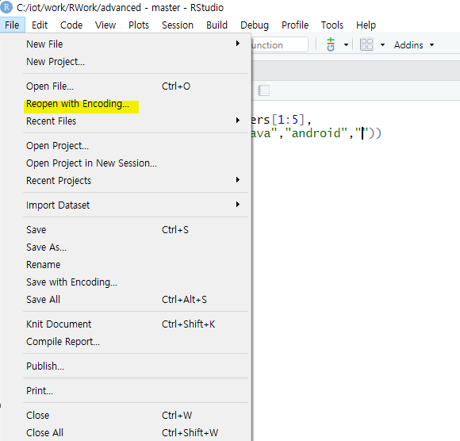
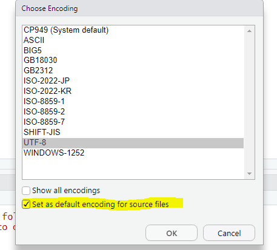
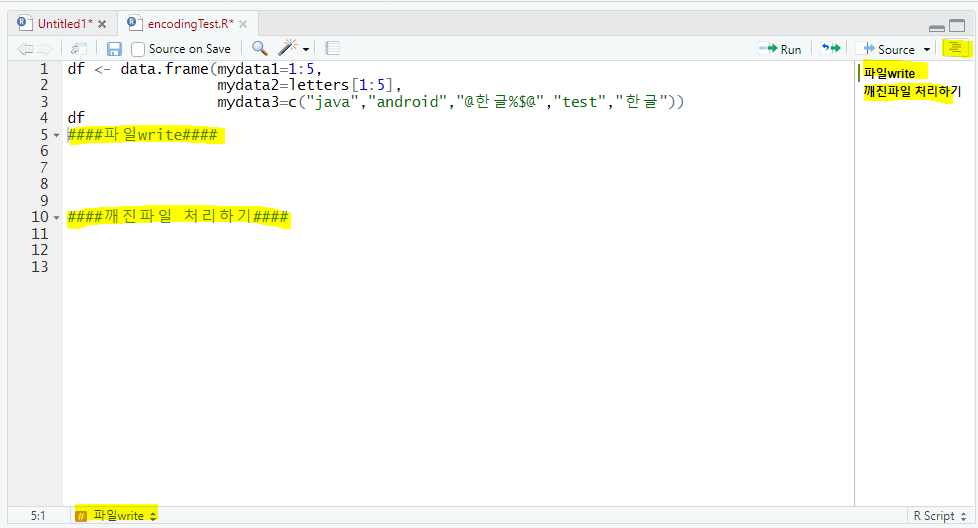
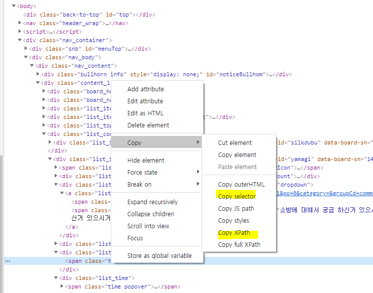
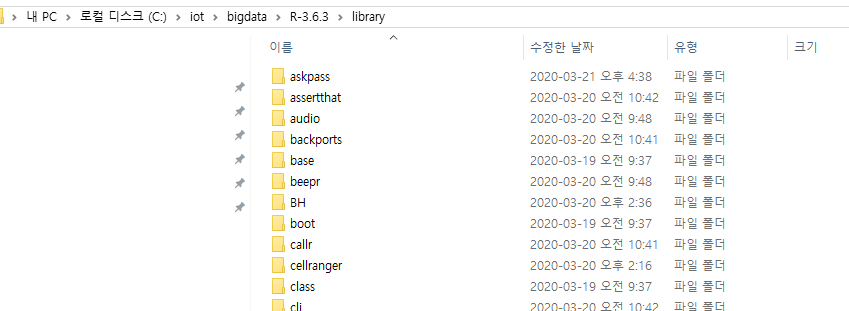

## R

### 200319

줄바꿈 명령어

### 200320

[데이터 분석]

1. 데이터 가져오기

   - 외부파일

   - 크롤링

   - DB(오라클,mongodb,hadoop,.....)

     ===> R 에서 사용할 수 있는 여러 형태의 데이터로 변환
     	 	변환된 데이터를 액세스

2. 데이터의 정보를 확인

   컬럼갯수, row갯수, 타입, 유형,

### 200321

apply_test

- apply

filter

- 데이터 정제
- 이상데이터 잘라내기

crawl

- 웹페이지에서 데이터를 추출 (csv저장)

##200323

final_data의 1번 글의 내용을 출력

