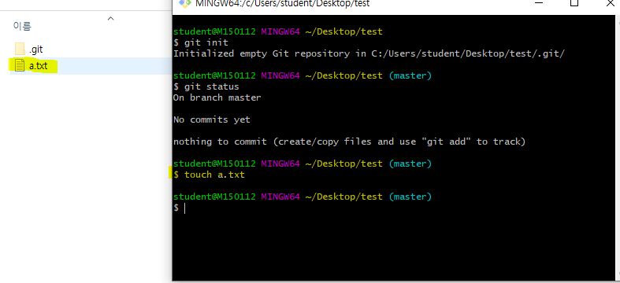
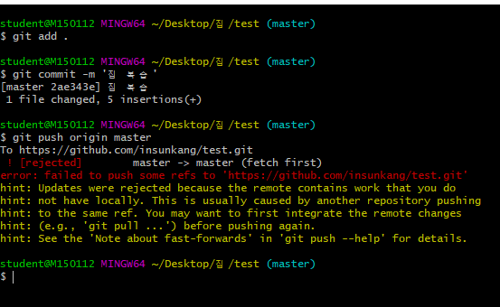

# git 특강 두번째

## git이란..?

- DVCS(분산형 버전 관리 시스템)
- git status, CLI (Command Line Interface)



touch => 생성


## Git status를 통해 정리하기

### CLI 기초 명령어

```bash
#list(파일목록)
$ ls
#change directory(디렉토리 변경)
$ cd
#빈 파일 생성
$ touch <파일명>

```

### 1. 상황

#### 1. add

```bash
$ touch a.txt
$ git status
On branch master
# 트래킹 x, 새로 생성된 파일.
No commits yet
	# 커밋을 하기 위한 곳에 포함시키려면
	# Staging area로 이동시키려면, git add
Untracked files:
  (use "git add <file>..." to include in what will be committed)
        a.txt
# WD에 새로운 파일 존재 but Staging area에는 없다.
nothing added to commit but untracked files present (use "git add" to track)

```

```bash
$ git add a.txt
$ git status
On branch master

No commits yet
# 커밋될 변경사항들(Staging area에 있다)
Changes to be committed:
	# unstage를 위해서 활용할 명령어(add 취소)
  (use "git rm --cached <file>..." to unstage)
        new file:   a.txt

```

#### 2. commit

```bash
$ git commit -m 'Create a.txt'
[master (root-commit) 0c0b123] Create a.txt
 1 file changed, 0 insertions(+), 0 deletions(-)
 create mode 100644 a.txt

```

- 커밋 내역 확인

  ```bash
  $ git log
  commit 0c0b1235aa58c8b56af9eb177bd8cdc685c15cec (HEAD -> master)
  Author: insunkang <cactus2378@naver.com>
  Date:   Thu Apr 23 10:34:31 2020 +0900
  
      Create a.txt
  $ git log --oneline
  0c0b123 (HEAD -> master) Create a.txt
  
  ```

#### 3. 추가 파일 변경 상태

````bash
$ touch b.txt
$ git status
On branch master
Changes not staged for commit:
  (use "git add <file>..." to update what will be committed)
  (use "git restore <file>..." to discard changes in working directory)
        modified:   a.txt

Untracked files:
  (use "git add <file>..." to include in what will be committed)
        b.txt

no changes added to commit (use "git add" and/or "git commit -a")

````


#### 4. 커밋 취소

> **주의!!!** 커밋 메시지 변경시 해시값 자체가 변경되어, 
> 이미 원격 저장소에 push한 이력에 대해서는 메시지 변경을 하면 안된다

```bash
$ git commit --amend
```

- vim 텍스트 편집기가 실행된다
  - i : 편집모드
  - esc : 편집 모드를 종료하고, 명령모드에서 저장
    -  :wq
      - write +quit

```bash
$ git commit --amend
[master 7c2beae] a.txt 추가
 Date: Thu Apr 23 10:45:26 2020 +0900
 1 file changed, 18 insertions(+), 1 deletion(-)

```

#### 4-1 특정 파일을 빼놓고 커밋 했을 때

```bash
$ git add <omit_file>
$ git commit --amend
```

- 빼뜨린 파일을 add 한 이후에 commit --amend를 하면, 해당 파일까지 포함하며 재커밋이 이루어진다.

#### 5. 작업 내용을 이전 버전으로 되돌리기

- a.k.a 작업 하단 내용 버리기

```bash
$ git status
On branch master
Changes not staged for commit:
  (use "git add <file>..." to update what will be committed)
  # WD 변경사항을 버리기 위해서는 restore!
  (use "git restore <file>..." to discard changes in working directory)
        modified:   a.txt

no changes added to commit (use "git add" and/or "git commit -a")

$ git restore a.txt
$ git status
On branch master
nothing to commit, working tree clean

```

#### 6. 특정 파일/폴더 삭제 커밋

> 해당 명령어는 실제 파일이 삭제되는 것은 아니지만, git에서 삭제되었다라는 이력을 남기는 것.

```bash
$ git rm --cached b.txt
$ git status
On branch master
Changes to be committed:
  (use "git restore --staged <file>..." to unstage)
        deleted:    b.txt

Changes not staged for commit:
  (use "git add/rm <file>..." to update what will be committed)
  (use "git restore <file>..." to discard changes in working directory)
        deleted:    a.txt

Untracked files:
  (use "git add <file>..." to include in what will be committed)
        b.txt
# 주의 !! 해당 파일이 물리적으로 삭제 되는 것은 아니다.

```

- 일반적으로는 .gitignore와 함께 활용한다.

  1. .gitignore에 해당 파일 등록
  2. git rm --cached를 통해 삭제 커밋

  - 이렇게 작업을 하면, 실제 파일은 삭제되지 않지만 이후로 git으로 전혀 관리되지 않는다.

### 2. .gitignore

- git으로 관리하고 싶지 않는 파일을 등록하여 활용할 수 있다.
- 일반적으로 프로젝트 환경(IDE,OS 등)에 관련된 정보나 추가적으로 공개되면 안되는 데이터 파일 등을 설정한다.
- 일반 프로젝트 환경에 대한 정보는 우선[gitignore.io](http://gitignore.io/)에서 프로젝트 시작할 때마다 정의하는 습관을 가지자.


### 3. 원격 저장소 활용 명령어

1. 원격 저장소 목록 조회

```bash
$ git remote -v
origin https://github.com/insunkang/bigiot-a.git
origin https://github.com/insunkang/bigiot-a.git
```

2. 원격 저장소 설정 삭제

```bash
$ git remote rm {원격저장소 이름}
```

3. 원격 저장소 설정

```bash
$ git remote add origin {url}
```

```bash
$ git config --global -l
```

## 사이트

### 정적 사이트 생성기(generator)

.md ==> HTML/CSS, JS

- jekyll(ruby)
  - 오래 되고, 자료 많고
- gatsby(js, react + graphql)
  - 최신, 근데 유명해서 자료 많음

## 200424 git branch, git clone

- git clone



pull을 안받고 수정한뒤 push를 했을 때