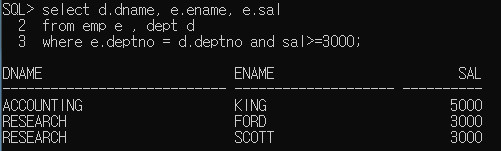
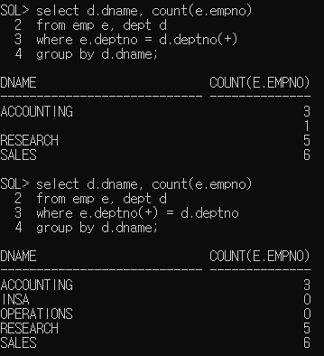
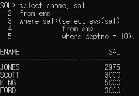

# 1.조인 (Join)

- 정규화된 테이블이나 혹은 일반적으로 작성된 여러 테이블의 컬럼을 이용해서 데이터를 조회하는 것을 조인이라고 한다.
- 조인은 관계형 데이터베이스에 반드시 알아야 하는 개념
- 기본키와 외래키의 관계를 이용해서 테이블을 조인 
  외래키를 가지고 기본키 데이블에서 값을 비교하여 작업이 진행된다.
- 조인을 하는 경우 무조건 where절에 조인조건을 정의해야 한다.
- 테이블을 여러 개 사용하는 경우 모든 테이블들의 조인조건을 정의해야하며 select절에 사용하지 않고 조건으로만 사용한다고 하더라도 조인조건은 정의해야한다.

## 1)조인방법

1. from절에 조회하고 싶은 데이터가 저장된 테이블들을 모두 명시
2. 조인을 하는 경우 컬럼이 어떤 테이블의 컬럼인지 명확하게 정의하기 위해 "테이블명.컬러명"으로 액세스를 한다.
3. from절에 테이블명을 정의하면서 alias를 함께 추가하여 alias를 통해 액세스하도록 한다.
   select alias1.컬러명, alias2.컬럼명 ...
   from  테이브1 alias1, 테이블2 alias2
4. where절에는 반드시 조인조건을 추가하며 조인조건에는 두 테이블의 값을 비교하기 위해
   정의하는 것이므로 주로 외래키와 기본키를 정의한다.
   외래키테이블(child테이블)에 정의된 컬럼값을 기본기테이블(parent테이블)에서 비교하여 정확하게 일치하는 경우에 값을 가져온다. (기본조인)..... : 일치하지 않을때도 가져오는 경우있음
   (테이블이 두 개 -> 조인조건 1개, 테이블이 세개 -> 조인조건 2개)
   

## 2)조인 종류

 - equi join (inner join) : 두 테이블에서 정확하게 일치하는 컬럼에 대한 데이터만 조인

 - outer join : 두 개 이상의 테이블에 조인을 적용했을때 join 조건을 만족하지 않아도 데이터를 조회하고 싶은 경우 사용. 조인조건에 (+)를 추가한다.
   join조건을 만족하지 않아도 한 쪽 테이블의 모든 데이터를 출력하고 싶을때 사용하는 조인방식으로 정보가 부족한 테이블의 컬럼의 (+)를 추가한다.

   > select 테이블 alias.컬럼명...
   > from 테이블 alias
   > where 테이블 alias.컬럼명 = 테이블 alias.컬럼명(+)
   > or
   > where 테이블 alias.컬럼명 (+)  = 테이블 alias.컬럼명
   > => (+)기호는 한쪽에만 사용한다. 
   > 데이터가 확장되어야 하는 곳에 추가한다.

- 

- self조인 : 두 개 이상의 테이블에서 조인하지 않고 같은 테이블의 컬럼들을 이용해서 조인(하나를 가상 테이블)

# 2. 서브쿼리(Sub Query)

- SQL문에 삽입된 query

- select 문에서 주로 사용하고 select문에 삽입된 select문 바깥쪽의 query를 main query, 안쪽에 삽입된 query를 sub query라 한다.

- sub query는 괄호로 묶어 주어야 한다.

- sub query는 메인쿼리가 실행되기 전에 한 번 실행되며 그 실행결과를 메인쿼리에서 사용한다.

- 

  

## [서브쿼리의 종류]

### 1) 단일행서브쿼리 : 결과가 1행 1열인 서브쿼리 >, >= ,< ,<=

​     

     [실습]
    
     전체 평균보다 높은 급여를 받는 사원의 목록(ename, sal)
    
     smith와 같은 job을 갖고 있는 사원의 목록(ename, job, hiredate)


​     

### 2) 다중행서브쿼리 

     - 서브쿼리의 실행결과가 열 하나의 행이 여러개 인 경우
     - = 연산자와 같은 비교연산자를 사용할 수 없다
     - in: 컬럼의 값이 정확하게 일치하는 경우
     - <any : 서브쿼리 결과의 최대값보다 작은 값을 구하는 경우
     - \>any : 서브쿼리 결과의 최소값보다 큰 값을 구하는 경우
     - <all : 서브쿼리 결과의 최소값보다 작은 값을 구하는 경우
     - \>all : 서브쿼리 결과의 최대값보다 큰 값을 구하는 경우

  [실습]

  10번 부서에 근무하는 사원들의 job과 같은 job을 갖고 있는 사원의 목록

  

### 3) 다중컬럼 서브쿼리

  - 두개 이상의 컬럼과 다중행을  반환하는 서브쿼리
  
  - 메인쿼리 비교 컬럼의 갯수, 종류가 서브쿼리의 반환 결과와 동일
  
    > where (컬럼1, 컬럼2) in (select 컬럼1, 컬럼2......)
  
    [실습]
  
    각 부서별로 최소급여를 받는 사원의 정보를 출력(ename, deptno, sal, hiredate)

### 4) 상관형 서브쿼리(상호연관 서브쿼리)

  - 메인쿼리의 값이 서브쿼리에서 사용되는 경우
  
  - 메인쿼리 한 row에 대해 서브쿼리가 한번씩 실행된다.
  
  - 메인쿼리의 값이 어떤 값이냐에 따라 서브쿼리의 결과가 달라진다.
    [실행]
  
    1. 메인쿼리에서 비교할 값을 가져온다.
    2. 메인쿼리에서 받은 값을 이용해서 서브쿼리가 실행된다.
    3. 서브쿼리의 실행결과로 메인쿼리가 실행된다.
    4. 메인쿼리의 레코드수만큼 반복된다.
  
    [실습]
    
    ```
    소속급여의 급여 평균보다 급여가 많은 사원들의 정보를 출력(ename, deptno, sal)
    ```
    
    ```sql
    select ename, deptno, sal
    from emp outer
    where sal > (select avg(sal)
               from emp e
               where e.deptno = outer.deptno);
    ```
    
    

### 5) from절에서 사용하는 서브쿼리(inline view)

- form절에 서브쿼리를 추가해서 사용

- 서브쿼리 결과를 가상 테이블로 사용하겠다는 의미

- from절에 추가되는 서브쿼리는 alias를 정의해야한다.

- from절에 추가되는 서브쿼리 내부의 컬럼은 실제 컬럼처럼
  메인쿼리에서 사용해야 하므로 컬럼도 컬럼명이 존재하거나 
  alias를 정의해야 한다.

  > select 컬럼명1.....
  > from (select 컬럼....
  > 			from 테이블명
  >
  > ​			where...
  >
  > ​			group by....     ) alias

```sql
select deptcode , countdata
from (select deptno as deptcode, count(empno) as countdata
      from emp
      group by deptno) mytable;
      
DEPTCODE  COUNTDATA
---------- ----------
        30          6
        20          6
        10          3
```

소속부서의 급여 평균보다 급여가 많은 사원들의 정보를 출력
=> 조인과 from절에 추가하는 서브쿼리를 이용해서 작업

```sql
SQL> select e.ename, e.deptno, e.sal, d.avgsal
  2  from emp e, (select deptno, avg(sal) avgsal
  3               from emp
  4               group by deptno) d
  5  where e.deptno = d.deptno
  6             and e.sal > d.avgsal;

ENAME                    DEPTNO        SAL     AVGSAL
-------------------- ---------- ---------- ----------
BLAKE                        30       2850 1566.66667
ALLEN                        30       1600 1566.66667
FORD                         20       3000 2029.16667
SCOTT                        20       3000 2029.16667
JONES                        20       2975 2029.16667
KING                         10       5000 2916.66667
```

# 3.데이터 등록

```sql
SQL> create table member(
  2             id varchar2(10),
  3             pass varchar2(10),
  4             addr varchar2(20));

Table created.


====================================================================
SQL> insert into member values('jang' ,'1234', '서울');

1 row created.


====================================================================
SQL> insert all
  2         into member values('lee' ,'1234', '인천')
  3         into member values('kang' ,'1234', '안산')
  4         into member values('hong' ,'1234', '수원');
            into member values('hong' ,'1234', '수원')
                                                     *
ERROR at line 4:
ORA-00928: missing SELECT keyword


====================================================================
SQL> insert all
  2         into member values('lee' ,'1234', '인천')
  3         into member values('kang' ,'1234', '안산')
  4         into member values('hong' ,'1234', '수원')
  5  select * from dual;

3 rows created.


====================================================================
SQL> select * from member;

ID                   PASS                 ADDR
-------------------- -------------------- ------------------
jang                 1234                 서울
lee                  1234                 인천
kang                 1234                 안산
hong                 1234                 수원


====================================================================
SQL> insert into member values('jjang',null,null);

1 row created.


====================================================================
SQL> select * from member;

ID                   PASS                 ADDR

-------------------- -------------------- ---------

jang                 1234                 서울
lee                  1234                 인천
kang                 1234                 안산
hong                 1234                 수원
jjang


====================================================================
SQL> commit;

Commit complete.
```


# 4. 데이터 삭제

```sql
SQL> delete member;

5 rows deleted.

====================================================================

SQL> select * from member;

no rows selected

====================================================================

SQL> rollback;

Rollback complete.

====================================================================

SQL> select * from member;

ID                   PASS                 ADDR
-------------------- -------------------- -----
jang                 1234                 서울
lee                  1234                 인천
kang                 1234                 안산
hong                 1234                 수원
jjang


====================================================================
SQL> delete from member
  2  where id ='jjang';

1 row deleted.

SQL> select * from member;

ID                   PASS                 ADDR
-------------------- -------------------- -----
jang                 1234                 서울
lee                  1234                 인천
kang                 1234                 안산
hong                 1234                 수원
====================================================================
## 수정(subquery 사용)

SQL> update member
  2  set addr = (select addr
  3              from member
  4              where id = 'jang')
  5  where id = 'lee';

1 row updated.

SQL> select * from member;

ID                   PASS                 ADDR
-------------------- -------------------- -----
jang                 1234                 서울
lee                  1234                 서울
kang                 1234                 안산
hong                 1234                 수원
====================================================================
## 삭제(subquery 사용)

SQL> delete
  2  from member
  3  where addr = (select addr
  4                from member
  5                where id = 'jang');

2 rows deleted.

SQL> select * from member;

ID                   PASS                 ADDR
-------------------- -------------------- ----
kang                 1234                 안산
hong                 1234                 수원
```

